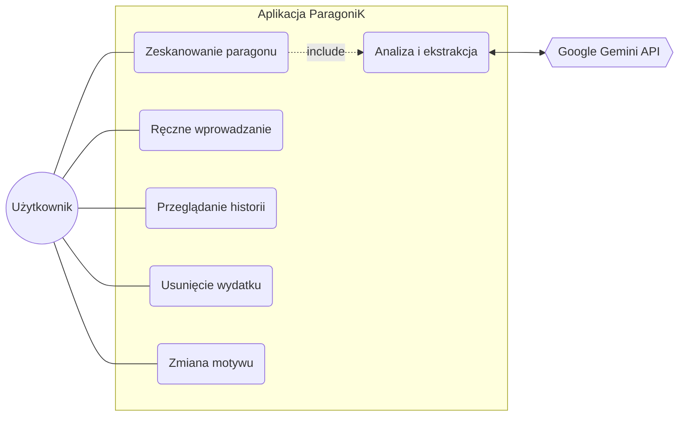

# ParagoniK

ParagoniK to nowoczesna, inteligentna aplikacja do śledzenia wydatków, stworzona przy użyciu React Native i Node.js. Eliminuje problem ręcznego wprowadzania danych, wykorzystując sztuczną inteligencję Google Gemini do automatycznego wyodrębniania danych z paragonów (nazwa sklepu, dokładna kwota i kategoria) bezpośrednio ze zdjęć.

## Problem biznesowy:

Codzienne, ręczne wprowadzanie danych z paragonów do systemów śledzenia budżetu jest czasochłonne, monotonne i podatne na błędy ludzkie. Skutkuje to zniechęceniem użytkowników do regularnego kontrolowania swoich finansów.

## Cel projektu:

Automatyzacja i uproszczenie procesu zarządzania finansami osobistymi. Aplikacja rozwiązuje ten problem, wykorzystując model AI do analizy zdjęć paragonów, z których automatycznie wyodrębnia kluczowe dane (nazwa sklepu, kwota, data, kategoria). Projekt ma również cel edukacyjny – demonstrację integracji nowoczesnych technologii frontendowych (React Native) z backendowymi usługami opartymi na sieciach neuronowych (Google Gemini).

## Kluczowe funkcje

* **Skaner paragonów AI:** Zrób zdjęcie paragonu lub wybierz je z galerii. Backend aplikacji łączy się z Gemini AI, aby błyskawicznie przeanalizować dane i przypisać wydatek do odpowiedniej kategorii.
* **Szybkie wprowadzanie ręczne:** Uproszczony interfejs do wprowadzania codziennych wydatków gotówkowych, zawierający przyciski szybkiego wyboru kwot oraz estetyczne, oznaczone kolorami kategorie.
* **Zapis danych offline:** Cała historia finansowa jest bezpiecznie przechowywana w pamięci urządzenia za pomocą `AsyncStorage`. Twoje dane zostają z Tobą, nawet bez połączenia z internetem.
* **Intuicyjne gesty:** Pomyłka przy dodawaniu? Po prostu przesuń palcem w lewo na dowolnym wydatku w historii, aby płynnie go usunąć.
* **Dynamiczne motywy:** Pełne wsparcie dla trybu jasnego i ciemnego, automatycznie dostosowujące się do preferencji systemowych użytkownika.
* **Reakcja haptyczna:** Uczucie obcowania z aplikacją premium dzięki delikatnym wibracjom (`expo-haptics`) podczas interakcji z kluczowymi elementami interfejsu.

## Technologie

**Frontend (Aplikacja mobilna)**
* React Native / Expo: Główny framework do budowy wieloplatformowej aplikacji mobilnej.
* Expo Router: Zaawansowany system nawigacji oparty na plikach.
* TypeScript: Statyczne typowanie zapewniające bezpieczeństwo i przewidywalność kodu.
* `react-native-gesture-handler`: Biblioteka do obsługi płynnych gestów (np. swipe-to-delete).
* `@react-native-async-storage/async-storage`: Lokalna, trwała baza danych do przechowywania historii wydatków offline.
* `Expo Camera `, `expo-image-picker`, `expo-image-manipulator`: Moduły do obsługi aparatu i galerii urządzenia.

**Backend (API)**
* Node.js, Express: Środowisko uruchomieniowe i framework do tworzenia serwera REST API.
* `multer`: Middleware do obsługi formularzy wieloczęściowych, używany do odbierania przesyłanych zdjęć.
* Google Gemini AI `@google/generative-ai`: Zewnętrzne API wykorzystujące model Gemini 2.5 Flash do parsowania, kategoryzacji i ekstrakcji danych z obrazów paragonów.

### Use Case Diagram (Diagram przypadków użycia)
Poniżej przedstawiono wizualizację funkcjonalności systemu z perspektywy Głównego Aktora (Użytkownika) oraz Aktora Pomocniczego (Systemu AI).


Opis przypadków użycia:

* Użytkownik może dodawać wydatki na dwa sposoby: skanując paragon lub wypełniając intuicyjny formularz ręczny.

* Proces skanowania paragonu wymusza («include») proces analizy obrazu, za który odpowiada zewnętrzny system Google Gemini API.

* Użytkownik ma pełną kontrolę nad historią (przeglądanie, płynne usuwanie) oraz konfiguracją wizualną aplikacji (zmiana motywu).


## Podział ról w zespole
Matsvei Buniankou (Full-Stack / Lead Developer): Główny programista projektu.

* Frontend: Zaprojektowanie i wdrożenie interfejsu (UI/UX) w React Native, implementacja nawigacji (Expo Router), zarządzanie stanem aplikacji (Context API), integracja lokalnej bazy danych (AsyncStorage) oraz obsługa płynnych gestów i haptyki.

* Backend: Architektura serwera w Node.js, implementacja obsługi przesyłania plików multimedialnych (Multer) oraz bezpieczna integracja z systemem sztucznej inteligencji (Google Gemini API) w celu parsowania paragonów.

## Jak uruchomić lokalnie

1. Sklonuj repozytorium.
2. Zainstaluj zależności:
```bash
   npm install
```

1. Uruchom serwer deweloperski Expo:
```bash
 npx expo start -c
```
Zeskanuj kod QR za pomocą aplikacji Expo Go na swoim fizycznym urządzeniu.

* Stworzone jako inteligentne rozwiązanie do zarządzania finansami osobistymi.
